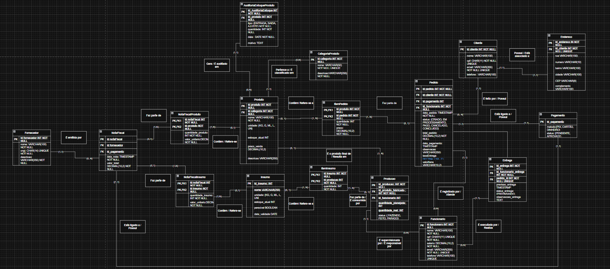

# 🍔 Sistema de Gerenciamento de Delivery de Restaurante

Este projeto foi desenvolvido com o objetivo de criar um **sistema completo de gerenciamento para operações de Delivery de Restaurante**, incluindo os fluxos de **Vendas**, **Produção**, **Compras** e **Controle de Estoque**.

O foco principal é garantir rastreabilidade e consistência no estoque, controle financeiro dos pedidos, movimentação de insumos e produtos acabados, e uma visão consolidada para análise gerencial.

## 📘 Objetivo da Aplicação

A aplicação integra os principais fluxos de negócio de um restaurante que opera por delivery:

| Módulo       | Descrição                                                          |
| ------------ | ------------------------------------------------------------------ |
| **Vendas**   | Registro de pedidos, itens e acompanhamento de entrega.            |
| **Produção** | Controle de fabricação de produtos a partir de insumos.            |
| **Compras**  | Registro de notas fiscais de fornecedores para entrada de estoque. |
| **Estoque**  | Controle centralizado e auditável de movimentações.                |

## 🧭 Modelo Lógico do Banco de Dados

Abaixo está o modelo lógico utilizado no projeto:



## ⚙️ Requisitos Funcionais

- Cadastro, edição e listagem de **Clientes**, **Funcionários**, **Produtos**, **Insumos** e **Fornecedores**.
- Registro de **Pedidos** com múltiplos itens.
- Registro de **Notas Fiscais** de fornecedores para entrada de estoque.
- Controle do **ciclo de produção**, consumindo insumos e gerando produtos acabados.
- **Gestão automática de estoque** com histórico completo via `TRIGGER`.
- Controle de **pagamento** do pedido e atualização de status: `PENDENTE`, `APROVADO`, `REJEITADO`.
- **Rastreamento de entrega** associada a um funcionário (`Entrega`).
- Emissão de **relatórios e views analíticas** (vendas, produção, estoque).

## 🧱 Requisitos Não Funcionais

- Banco de dados **PostgreSQL** com forte tipagem (uso de `ENUM`).
- Garantia de **integridade transacional** em fluxos complexos.
- Performance e consistência em módulos de vendas e auditoria.
- Controle de acesso baseado em **perfil de usuário** (ex.: Cozinheiro, Entregador, Gerente).

## 📋 Regras de Negócio

- O **estoque** de `Produto` e `Insumo` **não é atualizado diretamente**: todas as movimentações ocorrem via **tabela `AuditoriaEstoqueProduto`** (mantida por `TRIGGER`).
- O consumo de insumos na produção é registrado em **unidades inteiras**.
- Status de pedidos: `CRIADO`, `EM_PROCESSAMENTO`, `PAGO`, `CANCELADO`, `CONCLUIDO`.
- CPF e E-mail de **Cliente** devem ser **únicos**.
- Uma `Entrega` está sempre vinculada a **um único pedido**.
- O pagamento deve ser registrado antes do processamento do pedido.

## 🧩 Estrutura do Banco de Dados

### 🐘 Banco

- PostgreSQL 16
- Modelagem do esquema realizada via **draw.io**

### 📦 Arquivos SQL (Estrutura + Simulação de Fluxos)

| Arquivo                    | Função                                                                 | Etapa do Processo      |
| -------------------------- | ---------------------------------------------------------------------- | ---------------------- |
| **`1_ddl_completo.sql`**   | Criação completa das tabelas, tipos ENUM, chaves e restrições          | Estruturação do banco  |
| **`2_dados_base.sql`**     | Inserção de clientes, funcionários, produtos, insumos e dados iniciais | Configuração inicial   |
| **`3_fluxo_compras.sql`**  | Registro de Notas Fiscais e entradas de estoque                        | Abastecimento          |
| **`4_fluxo_producao.sql`** | Consumo de insumos e geração de produtos acabados                      | Cozinha / produção     |
| **`5_fluxo_venda.sql`**    | Registro de pedidos, pagamento, entrega e baixas de estoque            | Operação de venda real |

### Views Analíticas (`6_views.sql`)

As Views ajudam na análise do restaurante, reunindo informações que facilitam consultas e relatórios.

1. **vw_estoque_detalhado**  
   Mostra o estoque atual de produtos e insumos junto do histórico de movimentações. Útil para auditoria e controle de perdas.

2. **vw_detalhes_pedidos**  
   Exibe pedidos completos: cliente, itens, valores, status de pagamento e entrega. Principal visão para análise de vendas.

3. **vw_rastreio_notas_fiscais**  
   Consolida informações de notas fiscais de compras (insumos e produtos). Suporte ao controle de custos e fornecedores.

4. **vw_analise_producao**  
   Relaciona produção de produtos com consumo de insumos. Permite calcular custo real e validar baixas de estoque.

5. **vw_pedidos_pendentes_entrega**  
   Lista pedidos ainda não entregues. Auxilia no fluxo de expedição e organização de entregadores.

6. **vw_analise_vendas_categoria**  
   Agrupa vendas por categoria, destacando volume e receita. Usado para decisões estratégicas de cardápio e estoque.

## ▶️ Como Executar os Scripts SQL

Os arquivos `.sql` estão organizados na pasta `sql-scripts`, seguindo a ordem correta de execução:

```
sql-scripts/
│
├── 1_ddl_completo.sql
├── 2_dados_base.sql
├── 3_fluxo_compras.sql
├── 4_fluxo_producao.sql
├── 5_fluxo_venda.sql
└── 6_views.sql
```

> **Observação:** o arquivo `6_views.sql` contém **views analíticas** que devem ser criadas **após** a execução dos scripts de estrutura e dos fluxos (1 → 5). As views dependem das tabelas e dados gerados pelos scripts anteriores.

### Pré-requisitos

- PostgreSQL instalado
- Um banco de dados criado (exemplo: `delivery_db`)
- Usuário com permissões para criar objetos (tables, views, types) no banco

### Passo a Passo via Terminal (psql)

Execute os scripts **na ordem** abaixo:

```bash
psql -U seu_usuario -d delivery_db -f sql-scripts/1_ddl_completo.sql
psql -U seu_usuario -d delivery_db -f sql-scripts/2_dados_base.sql
psql -U seu_usuario -d sql-scripts/3_fluxo_compras.sql
psql -U seu_usuario -d delivery_db -f sql-scripts/4_fluxo_producao.sql
psql -U seu_usuario -d delivery_db -f sql-scripts/5_fluxo_venda.sql
# Por fim, rode as views (opcionalmente em um step separado)
psql -U seu_usuario -d delivery_db -f sql-scripts/6_views.sql
```

Se preferir, você pode rodar tudo em uma linha (atenção à ordem):
```bash
psql -U seu_usuario -d delivery_db -f sql-scripts/1_ddl_completo.sql && psql -U seu_usuario -d delivery_db -f sql-scripts/2_dados_base.sql && psql -U seu_usuario -d delivery_db -f sql-scripts/3_fluxo_compras.sql && psql -U seu_usuario -d delivery_db -f sql-scripts/4_fluxo_producao.sql && psql -U seu_usuario -d delivery_db -f sql-scripts/5_fluxo_venda.sql && psql -U seu_usuario -d delivery_db -f sql-scripts/6_views.sql
```

### Passo a Passo via pgAdmin

1. Abra o banco de dados `delivery_db`.
2. Vá em **Query Tool**.
3. Selecione `File > Open` e abra o primeiro script (`1_ddl_completo.sql`) e execute com **F5**.
4. Repita o processo para os demais arquivos na ordem listada acima.
5. No final, abra e execute o `6_views.sql` para criar as views analíticas.

### Sugestões / Problemas comuns

- **Erro de dependência:** rode os scripts na ordem correta. Views podem falhar se alguma tabela ou coluna não existir ainda.
- **Permissões:** execute com um usuário que tenha permissão de criação de views e objetos no schema.
- **Search_path:** se você usa schemas customizados, ajuste `search_path` no começo dos scripts ou execute `SET search_path TO seu_schema;` antes de rodar os scripts.


## 🚀 Tecnologias Utilizadas

| Tecnologia                                  | Uso                         |
| ------------------------------------------- | --------------------------- |
| PostgreSQL 16                               | Banco de dados              |
| SQL (DDL, DML, Views, Triggers, Transações) | Implementação da lógica     |
| draw.io                                     | Modelagem do banco e fluxos |

## 👥 Autores

| Nome                  | Função                        |
| --------------------- | ----------------------------- |
| Raffael Queiroga      | Modelagem e Fluxo de Produção |
| Thiago Nunes          | Estrutura e Regras de Estoque |
| Lucas Gabriel Andrade | Fluxo de Pedidos e Entrega    |
| Luiz Felipe           | Notas Fiscais e Compras       |

## 📄 Licença

Projeto desenvolvido para fins acadêmicos. Uso livre para estudo, análise ou melhoria.
